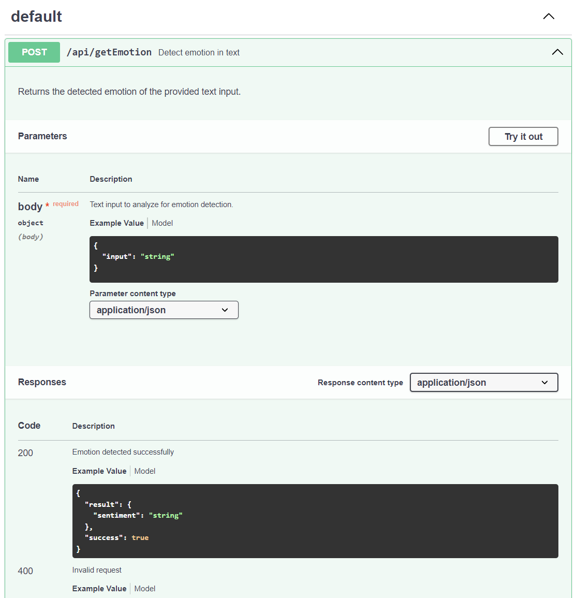

# SentymAnalyzer

Pour installer vos dépendances :

```bash
bun install
```

Pour lancer :

```bash
bun run index.ts
```

Ce projet a été créé en utilisant `bun init` dans bun v1.1.0. [Bun](https://bun.sh) est un runtime JavaScript tout-en-un rapide.

## Workflow de Développement

Notre projet adopte une approche rigoureuse en matière de gestion de version et d'intégration continue/déploiement continu (CI/CD), afin de maintenir une haute qualité de code et de faciliter les déploiements.

### Branches Principales

-   **`main`** : La branche `main` est notre branche de production. Elle est protégée et ne peut être modifiée que via des pull requests validées. Cette approche garantit que tout changement apporté à `main` a été revu et testé, assurant ainsi la stabilité de notre environnement de production.

-   **`dev`** : La branche `dev` sert de zone de développement principale. Les développeurs fusionnent leurs branches de fonctionnalités dans `dev` pour intégrer et tester les changements dans un environnement partagé avant qu'ils ne soient prêts pour la production.

### CI/CD

-   **Intégration Continue sur `dev`** : La branche `dev` est équipée d'une pipeline CI qui exécute automatiquement les tests à chaque push. Cela nous permet de détecter et de résoudre rapidement les problèmes, assurant ainsi que notre base de code reste saine et testable à tout moment.

-   **CI/CD sur `main`** : En plus de l'exécution des tests, la branche `main` intègre une pipeline CI/CD complète. Lorsqu'une pull request est fusionnée dans `main`, la pipeline exécute les tests pour vérifier l'intégrité du code. Si les tests sont concluants, le processus de déploiement est déclenché, déployant automatiquement le projet sur GitHub Packages et Docker Hub. Ce processus automatisé garantit que notre application est toujours déployée avec les dernières modifications validées et testées.

### Processus de Pull Request

Pour garantir la qualité du code et la stabilité de l'application, nous suivons un processus strict de pull request :

1. **Création de la Pull Request** : Les développeurs créent des pull requests pour fusionner leurs branches de fonctionnalités dans `dev` ou `main`. La description de la pull request doit clairement résumer les changements proposés.

2. **Revue de Code** : Chaque pull request doit être examinée et approuvée par au moins un autre développeur. Cette étape assure une deuxième paire d'yeux sur les changements, contribuant à maintenir un code de haute qualité.

3. **Tests Automatiques** : La pipeline CI exécute automatiquement les tests sur la pull request. Une pull request ne peut être fusionnée que si tous les tests passent avec succès.

4. **Fusion** : Une fois approuvée et ayant passé tous les tests, la pull request peut être fusionnée dans la branche cible.

Ce workflow nous permet de maintenir un cycle de développement agile et sûr, tout en garantissant que notre application reste stable et performante pour nos utilisateurs.

## Conventions et Qualité du Code

Pour assurer la cohérence et la qualité de notre gestion de version, nous avons mis en place des conventions strictes pour les messages de commit, ainsi qu'un système de precommit pour en vérifier le respect.

### Convention des Messages de Commit

Nous adoptons une convention précise pour les messages de commit afin de faciliter la compréhension de l'historique des modifications et de soutenir l'automatisation de notre flux de travail. Chaque message de commit doit suivre le format suivant :

-   **`feat:`** pour les nouveaux développements ou fonctionnalités.
-   **`fix:`** pour les corrections de bugs.
-   **`docs:`** pour les modifications dans la documentation.
-   **`style:`** pour les changements qui n'affectent pas le sens du code (mise en forme, choix de nom, etc.).
-   **`refactor:`** pour une modification du code qui ni corrige un bug ni ajoute une fonctionnalité.
-   **`test:`** pour l'ajout ou la modification de tests.
-   **`chore:`** pour les tâches de maintenance ou autres tâches non liées au code.
-   **`perf:`** pour les améliorations de performances.
-   **`ci:`** pour les modifications apportées aux fichiers de configuration CI/CD.
-   **`build:`** pour les modifications apportées aux scripts de build ou aux dépendances.
-   **`revert:`** pour les réversions de commits précédents.

Cette structure permet une identification rapide du type de modifications effectuées et facilite la génération automatique de logs de version.

### Système de Precommit pour les Messages de Commit

Afin de garantir que tous les commits respectent notre convention, nous avons intégré un système de precommit qui vérifie automatiquement le format des messages de commit. Si un message ne respecte pas le format attendu, le commit est bloqué, et un message d'erreur est affiché pour guider le contributeur sur la façon de corriger son message.

#### Mise en Place

Le système de precommit est implémenté à l'aide de [outil de precommit, ex. Husky], qui est configuré pour exécuter un script de vérification avant chaque commit.

## Documentation

L'API de notre application est documentée à l'aide de [Swagger](https://swagger.io/), une spécification ouverte pour la documentation des API RESTful. Swagger fournit une interface interactive qui permet aux développeurs d'explorer les endpoints de l'API, de tester les requêtes et de visualiser les réponses.


